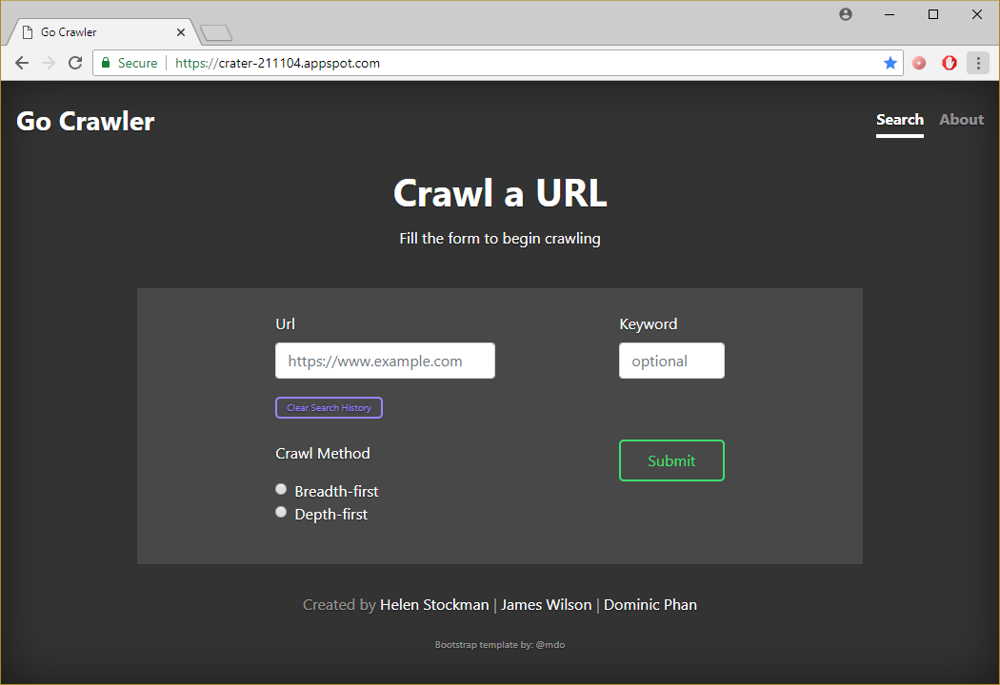
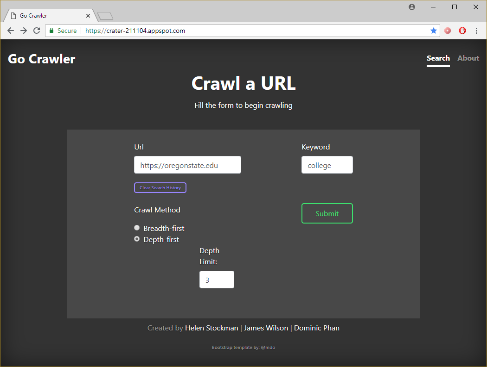
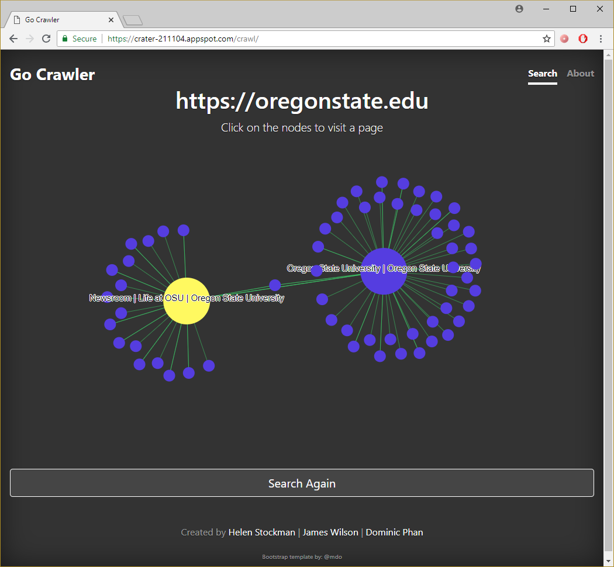
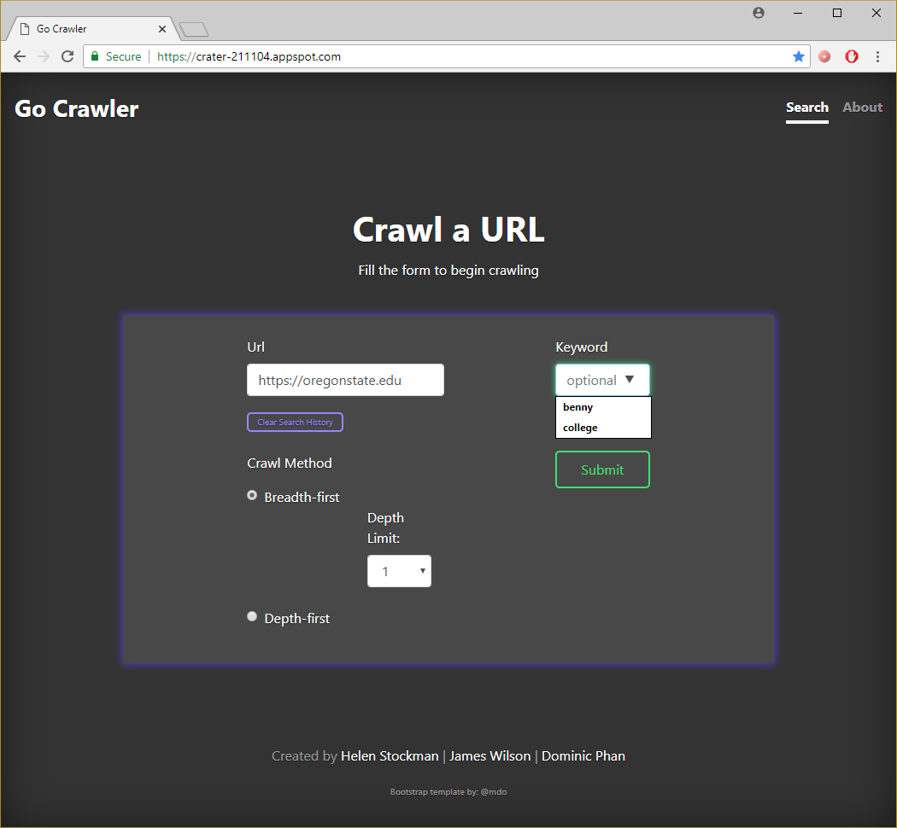

# Graphical Web Crawler
Welcome!

This branch houses the deployment version of the program as a web app.
It is hosted using the Google Cloud App Engine at [https://crater-211104.appspot.com][app]

## Team Crater
* Helen Stockman
* James Wilson
* Dominic Phan

## Usage Instructions
Visit the application webpage [https://crater-211104.appspot.com][app] and fill out the form.

The URL needs to begin with `https://`.
The keyword is optional and is searched for. If found, the crawl stops and highlights the page's URL node.
Be sure to pick a Crawl Method and Depth Limit or else the crawl graph will be empty!
The Breadth-first limit is limited to 1 or 2 because higher values are likely to crash the server. 
The Depth-first limit is not limited but be aware that higher values may crash the server.
Click Submit to show the crawl graph.

The crawl graph is interactive with zoom, panning, and draggable nodes.
Click on a node to visit its URL or click Search Again to do another crawl.

URL and Keyword history is stored using cookies and is shown by clicking the input box.
Clear history by clicking the Clear Search History button.

## Installation
From the Google Cloud Platform project dashboard, select `Activate Google Cloud Shell`.
Set up your workspace and clone this repo.

* Test - `$ dev_appserver.py app.yaml` and select `Web Preview`.
* Deploy - `$ gcloud app deploy`
* View - `$ gcloud app browse`

## Resources
https://cloud.google.com/appengine/docs/standard/go/tools/using-local-server
https://cloud.google.com/appengine/docs/flexible/go/testing-and-deploying-your-app

[app]: https://crater-211104.appspot.com
